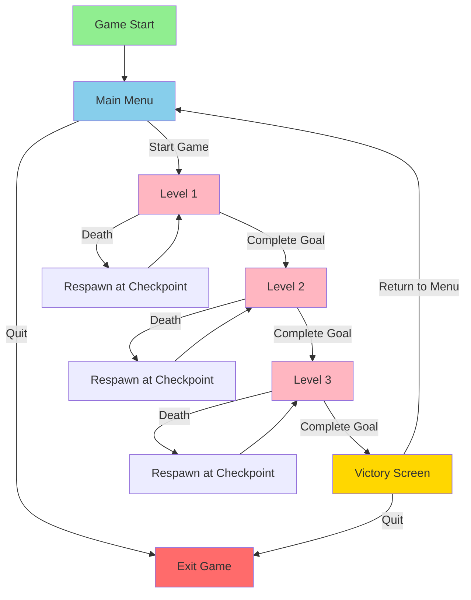
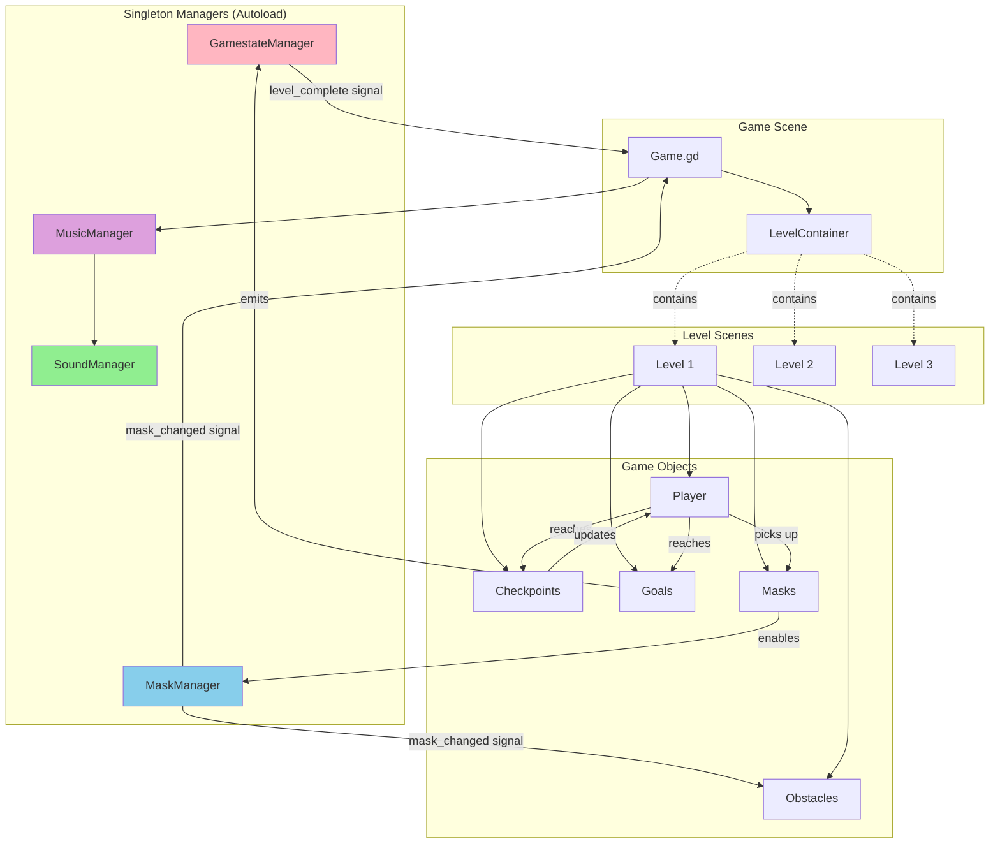
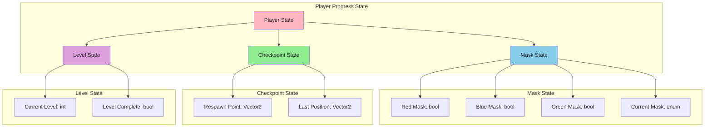
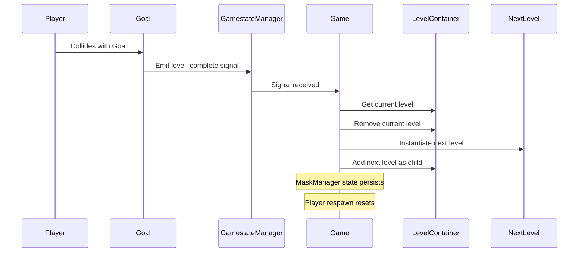

# Scene Transition Architecture

This document describes the architecture for managing scene transitions and global state in this Godot platformer project.

## Overview

The game uses a **singleton-based architecture** with centralized state management to handle scene transitions, player progress, and game state across multiple levels. The architecture is designed to be scalable and maintainable for further development.

## Architecture Diagrams

### 1. Scene Transition Flow



### 2. Global State Management Architecture



### 3. Player State Management



### 4. Scene Transition Sequence



## Current Implementation

### Singleton Managers

#### GamestateManager (`scripts/managers/gamestate_manager.gd`)
- **Purpose**: Manages game state and level progression
- **Signals**: 
  - `level_complete`: Emitted when a goal is reached
- **Responsibilities**: Track level completion events

#### MaskManager (`scripts/managers/mask_manager.gd`)
- **Purpose**: Manages mask collection and activation state
- **Signals**:
  - `mask_changed()`: Emitted when mask state changes
- **State**:
  - `masks: Dictionary[MASK_COLOR, bool]`: Tracks collected masks
  - `current_color: MASK_COLOR`: Active mask color
- **Methods**:
  - `toggle(color)`: Toggle mask on/off
  - `enable_mask_color(color)`: Unlock a mask
  - `reset_masks()`: Reset mask state to NONE
  - `reset_mask_state(skip_tutorial)`: Reset all collected masks

### Game Scene (`scripts/managers/game.gd`)
- **Purpose**: Main game orchestrator and level container
- **Responsibilities**:
  - Load and instantiate levels
  - Listen to GamestateManager signals for level progression
  - Manage music transitions based on mask changes
  - Coordinate between levels and managers

### Level Components

#### Goal (`scripts/goal.gd`)
- Emits `level_complete` signal when player reaches it
- Triggers level transition

#### Checkpoint (`scripts/checkpoint.gd`)
- Updates player's respawn point
- Self-destructs after activation (one-time use)

#### Player (`scripts/player/player.gd`)
- Maintains `spawn_point` for respawning
- Can update respawn point via checkpoints

## Scene Organization

```
platformer/scenes/
├── game.tscn                    # Main game scene
├── managers/
│   └── game.tscn               # Game manager scene node
├── levels/
│   ├── level_1.tscn            # First level
│   ├── level_2.tscn            # Second level
│   └── level_3.tscn            # Third level
├── player/
│   └── player.tscn             # Player character
├── masks/
│   ├── red_mask.tscn
│   ├── blue_mask.tscn
│   └── green_mask.tscn
├── obstacles/
│   └── [colored platforms]
├── checkpoint_scene.tscn
└── goal_scene.tscn
```

## Design Principles

### 1. Singleton Pattern for Global State
- **GamestateManager**, **MaskManager**, and **SoundManager** are autoloaded singletons
- Accessible from anywhere in the scene tree
- Persist across scene changes
- Use signals for loose coupling

### 2. Signal-Based Communication
- Components communicate via signals, not direct calls
- Reduces coupling between systems
- Makes it easy to add new listeners

### 3. Scene Composition
- Levels are self-contained scenes
- Player, obstacles, checkpoints, goals are composed into levels
- Easy to add/remove/modify levels

### 4. State Persistence
- Singleton managers maintain state across level transitions
- Mask collection persists (player keeps unlocked masks)
- Checkpoints are per-level (reset on level change)

## Extending the Architecture

### Adding New Scenes

#### Main Menu
```gdscript
# Create a new scene: scenes/ui/main_menu.tscn
# Main menu script example:
extends Control

func _on_start_pressed():
    get_tree().change_scene_to_file("res://scenes/game.tscn")

func _on_quit_pressed():
    get_tree().quit()
```

#### Victory/Game Over Screens
```gdscript
# Create scenes/ui/victory_screen.tscn
extends Control

func _ready():
    # Show stats, play victory music, etc.
    pass

func _on_continue_pressed():
    # Return to main menu or restart
    get_tree().change_scene_to_file("res://scenes/ui/main_menu.tscn")
```

### Adding Scene Transitions

For smooth transitions, consider using a **TransitionManager** singleton:

```gdscript
# scripts/managers/transition_manager.gd
extends CanvasLayer

signal transition_finished

func fade_to_scene(scene_path: String):
    # Fade out
    var tween = create_tween()
    tween.tween_property($ColorRect, "modulate:a", 1.0, 0.5)
    await tween.finished
    
    # Change scene
    get_tree().change_scene_to_file(scene_path)
    
    # Fade in
    tween = create_tween()
    tween.tween_property($ColorRect, "modulate:a", 0.0, 0.5)
    await tween.finished
    
    transition_finished.emit()
```

### Expanding State Management

To track additional state (e.g., score, time, collectibles):

```gdscript
# Extend GamestateManager:
extends Node

signal level_complete
signal score_changed(new_score: int)

var current_level: int = 1
var total_score: int = 0
var level_times: Dictionary = {}
var collectibles: Dictionary = {}

func add_score(points: int):
    total_score += points
    score_changed.emit(total_score)

func start_level(level_num: int):
    current_level = level_num
    level_times[level_num] = Time.get_ticks_msec()

func complete_level():
    var time_taken = Time.get_ticks_msec() - level_times[current_level]
    level_complete.emit()
```

## Best Practices

### 1. Level Design
- Keep levels self-contained and modular
- Use consistent naming: `level_1.tscn`, `level_2.tscn`, etc.
- Preload levels for performance: `var level_1 = preload('...')`

### 2. State Management
- Keep state in singleton managers, not in scene scripts
- Use signals to notify state changes
- Reset appropriate state when transitioning (e.g., checkpoints)

### 3. Scene Transitions
- Always clean up current level before loading next
- Use `queue_free()` or `remove_child()` to remove old scenes
- Consider adding transition effects for polish

### 4. Testing
- Test each level independently using Godot's "Play Scene" (F6)
- Test state persistence across transitions
- Test checkpoint and death mechanics

### 5. Performance
- Preload frequently used scenes
- Use `queue_free()` instead of `free()` for safer cleanup
- Remove signal connections when scenes are freed

## Future Enhancements

### Recommended Additions

1. **Scene Transition Manager**
   - Centralized scene loading with fade effects
   - Loading screens for larger levels
   - Transition animations

2. **Enhanced GameManager**
   - Save/load system for game progress
   - Level unlock system
   - Statistics tracking (deaths, time, collectibles)

3. **Menu System**
   - Main menu scene
   - Pause menu (ESC key)
   - Settings menu (audio, controls)

4. **Outcome Screens**
   - Victory screen with stats
   - Game over screen
   - Level complete screen with score/time

5. **Progressive Difficulty**
   - Track player deaths per level
   - Adaptive difficulty system
   - Optional hints after failures

6. **Checkpoint Enhancements**
   - Visual feedback for activation
   - Checkpoint counter/tracker
   - Save checkpoint state in GameManager

## Implementation Checklist

For implementing the full scene transition system:

- [ ] Create TransitionManager singleton with fade effects
- [ ] Design and implement main menu scene
- [ ] Create victory/game over screens
- [ ] Add pause menu functionality
- [ ] Implement level unlock system in GamestateManager
- [ ] Add save/load functionality
- [ ] Create loading screen for scene transitions
- [ ] Add statistics tracking (time, deaths, score)
- [ ] Implement settings menu (audio, controls)
- [ ] Add visual feedback for checkpoints
- [ ] Create level select screen
- [ ] Implement game state persistence across sessions

## Conclusion

This architecture provides a solid foundation for managing scene transitions and game state in a Godot platformer. The singleton-based approach with signal communication ensures loose coupling and easy extensibility. The system is designed to scale from the current 3-level game to a much larger project with multiple worlds, complex progression systems, and rich UI/UX elements.
